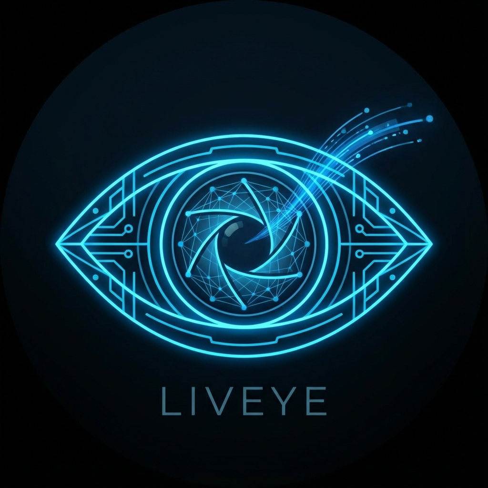

# LIVEYE - Real-time AI Object Detection PWA



**Real-time AI Object Detection in Your Browser**

LIVEYE is a Progressive Web App that uses YOLO models via ONNX Runtime Web to perform real-time object detection directly in your browser. Everything runs locally - no data leaves your device.

## ✨ Features

- 🎯 **Real-time Object Detection** - Detect objects through your webcam instantly
- 🔒 **Privacy-First** - All processing happens locally in your browser
- ⚡ **Fast & Responsive** - Optimized for performance on any device
- 🌐 **Cross-Platform** - Works on desktop and mobile browsers
- 📱 **Progressive Web App** - Install on your device for native-like experience
- 🎨 **Modern UI** - Futuristic neon-blue theme with smooth animations

## 🚀 Quick Start

### Prerequisites

- Node.js 16+ and npm
- A YOLO ONNX model file (see [Getting a Model](#getting-a-model))

### Installation

1. **Clone or navigate to the project**
   ```bash
   cd LiveEYE
   ```

2. **Install dependencies**
   ```bash
   npm install
   ```

3. **Add your YOLO model**
   - Place your `model.onnx` file in the `public/` folder
   - See [Getting a Model](#getting-a-model) for instructions

4. **Start development server**
   ```bash
   npm run dev
   ```

5. **Open in browser**
   - Navigate to `http://localhost:5173`
   - Grant camera permissions when prompted

## 📦 Getting a Model

You need a YOLO model in ONNX format. Here are your options:

### Option 1: Export from YOLOv5
```bash
git clone https://github.com/ultralytics/yolov5
cd yolov5
pip install -r requirements.txt
python export.py --weights yolov5s.pt --include onnx
```

### Option 2: Export from YOLOv8
```bash
pip install ultralytics
yolo export model=yolov8n.pt format=onnx
```

### Option 3: Download Pre-exported
- [YOLOv5s ONNX](https://github.com/ultralytics/yolov5/releases)
- [YOLOv8 ONNX](https://github.com/ultralytics/ultralytics)

**Recommended Models:**
- `yolov5s` or `yolov8n` for faster performance
- `yolov5m` or `yolov8s` for better accuracy

## 🛠️ Technology Stack

- **Framework**: React 18
- **Build Tool**: Vite 5
- **Styling**: TailwindCSS
- **AI Runtime**: ONNX Runtime Web
- **Animations**: Framer Motion
- **Routing**: React Router
- **PWA**: Vite PWA Plugin

## 📁 Project Structure

```
LiveEYE/
├── public/
│   ├── model.onnx        # Your YOLO model
│   ├── manifest.json     # PWA manifest
│   ├── icon-192.png      # App icon (192x192)
│   └── icon-512.png      # App icon (512x512)
├── src/
│   ├── pages/
│   │   ├── Landing.jsx   # Landing page
│   │   └── Live.jsx      # Live detection page
│   ├── components/
│   │   ├── CameraFeed.jsx        # Webcam access
│   │   ├── DetectionOverlay.jsx  # Bounding boxes
│   │   └── DetectionList.jsx     # Detection results
│   ├── utils/
│   │   └── onnxUtils.js  # ONNX inference logic
│   ├── App.jsx           # Main app component
│   ├── main.jsx          # Entry point
│   └── index.css         # Global styles
├── index.html
├── vite.config.js
├── tailwind.config.js
└── package.json
```

## 🎮 Usage

1. **Landing Page** (`/`)
   - Click "Start LIVEYE" to begin

2. **Live Detection Page** (`/live`)
   - Grant camera permissions
   - Wait for model to load
   - Click "Start Detection"
   - Watch real-time object detection!

## 🔧 Configuration

### Adjust Detection Thresholds

Edit `src/utils/onnxUtils.js`:

```javascript
const detections = postprocessOutput(
  output,
  metadata,
  0.5,  // Confidence threshold (0-1)
  0.45  // IoU threshold for NMS (0-1)
)
```

### Change Model Input Size

Edit `src/utils/onnxUtils.js`:

```javascript
preprocessImage(video, 640, 640)  // Change to your model's input size
```

## 📱 PWA Installation

### Desktop
1. Click the install icon in the browser address bar
2. Or use browser menu → Install LIVEYE

### Mobile
1. Open in browser (Chrome, Safari, etc.)
2. Tap "Add to Home Screen"
3. LIVEYE will appear as a native app icon

## 🏗️ Building for Production

```bash
# Build optimized production bundle
npm run build

# Preview production build
npm run preview
```

Build output will be in the `dist/` folder.

## 🌐 Deployment

Deploy to any static hosting service:

### Vercel
```bash
npm install -g vercel
vercel
```

### Netlify
```bash
npm install -g netlify-cli
netlify deploy --prod
```

### GitHub Pages
```bash
npm run build
# Upload dist/ folder to gh-pages branch
```

## ⚠️ Important Notes

### HTTPS Requirement
- Camera access requires HTTPS in production
- `localhost` works for development
- Ensure your hosting provides SSL certificate

### Browser Compatibility
- Modern browsers with WebAssembly support
- Chrome/Edge 91+, Firefox 89+, Safari 15+
- Camera API requires user permissions

### Performance Tips
- Use smaller YOLO models (yolov5s, yolov8n) for better FPS
- Reduce detection frequency if experiencing lag
- Consider lowering model input resolution

## 🐛 Troubleshooting

### Model Not Loading
- Ensure `model.onnx` is in `public/` folder
- Check browser console for errors
- Verify model is valid ONNX format

### Camera Not Working
- Grant camera permissions in browser settings
- Ensure HTTPS in production
- Check if camera is used by another app

### Poor Performance
- Try a smaller model (yolov8n instead of yolov8s)
- Reduce input resolution in `onnxUtils.js`
- Close other browser tabs

### Detection Accuracy Issues
- Adjust confidence threshold in `onnxUtils.js`
- Try a larger model for better accuracy
- Ensure good lighting conditions

## 🎨 Customization

### Change Theme Colors

Edit `tailwind.config.js`:

```javascript
colors: {
  neon: {
    blue: '#00BFFF',    // Change to your color
    dark: '#0099CC',
    light: '#33CCFF',
  },
}
```

### Modify Animations

Edit Framer Motion configs in components:

```javascript
initial={{ opacity: 0, y: 20 }}
animate={{ opacity: 1, y: 0 }}
transition={{ duration: 0.8 }}
```

## 📄 License

This project is open source and available under the MIT License.

## 🙏 Acknowledgments

- [ONNX Runtime](https://onnxruntime.ai/) - AI inference engine
- [Ultralytics](https://ultralytics.com/) - YOLO models
- [Framer Motion](https://www.framer.com/motion/) - Animations
- [TailwindCSS](https://tailwindcss.com/) - Styling

## 🤝 Contributing

Contributions are welcome! Feel free to:
- Report bugs
- Suggest features
- Submit pull requests

---

**Made with ❤️ and AI**

For questions or support, please open an issue on GitHub.
